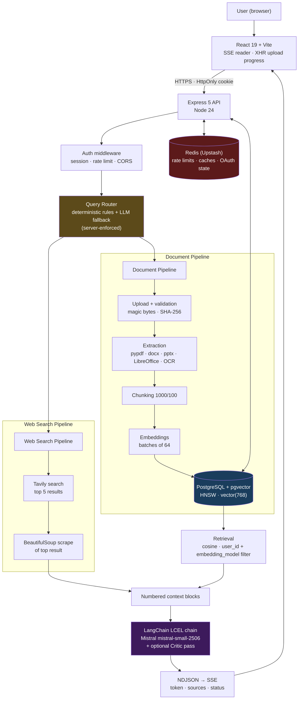

# Multi-User AI Document & Web Intelligence Platform

A production-style, multi-tenant AI research assistant. Users sign in with Google or
email/password, upload documents to a private library, and ask questions that are answered
from **their own documents**, from **live web search**, or from **both** — with streamed
token-by-token responses and real source citations.

The backend decides per message which information source to use. There is no manual mode
selector: the route is classified and **enforced server-side**, never taken from the client.

**Repository:** `BangerAtifAhmed/Multi-Agent-AI-Research-Assistant-using-LangChain`

---

## Table of Contents

| | | |
|---|---|---|
| [1. Overview](#1-project-overview) | [10. Web Search](#10-web-search) | [19. Setup](#19-setup) |
| [2. Key Features](#2-key-features) | [11. Auth & Security](#11-authentication--security) | [20. Environment Variables](#20-environment-variables) |
| [3. Architecture](#3-architecture) | [12. API](#12-api) | [21. Performance](#21-performance--scalability) |
| [4. Multi-Agent](#4-multi-agent-architecture) | [13. Frontend](#13-frontend) | [22. Engineering Decisions](#22-engineering-decisions) |
| [5. RAG Pipeline](#5-rag-pipeline) | [14. Deployment](#14-infrastructure--deployment) | [23. Known Limitations](#23-known-limitations) |
| [6. Document Processing](#6-document-processing) | [15. Testing](#15-testing) | [24. Future Improvements](#24-future-improvements) |
| [7. Scalability](#7-large-document-scalability) | [16. Failure Handling](#16-failure-handling) | [25. Resume Description](#25-resume-ready-project-description) |
| [8. Database](#8-database) | [17. Project Structure](#17-project-structure) | [26. Interview Prep](#26-interview-preparation) |
| [9. Embeddings](#9-embeddings) | [18. Technology Stack](#18-technology-stack) | |

---

## 1. Project Overview

### The problem

General-purpose chat assistants answer from training data. They cannot read your private
documents, and they confidently produce out-of-date figures for anything time-sensitive.
Naïve RAG implementations bolted onto them tend to break in three specific ways:

1. **Memory** — loading a whole document into RAM to chunk and embed it kills a small
   container. A 21 MB PDF (~1,100 chunks) was enough to restart a 512 MB instance.
2. **Isolation** — vector search that filters ownership *after* the query is one bug away
   from leaking another tenant's documents.
3. **Routing** — a question about a live box-office figure answered from a private document
   index (or from model memory) produces a fluent, wrong answer.

This platform addresses all three: streaming memory-bounded ingestion, ownership enforced
inside the SQL that performs the vector search, and deterministic server-side routing with a
hard override for time-sensitive questions.

### User workflow

```
User
 └─► Authentication ......... Google OAuth 2.0 or email + password → HttpOnly session cookie
      └─► Upload document ... extension + MIME + magic-byte validation, SHA-256 dedupe
           └─► Processing ... 202 Accepted; work continues in the background
                └─► Extraction ..... pypdf / python-docx / python-pptx / LibreOffice / OCR
                     └─► Chunking .. RecursiveCharacterTextSplitter (1000 / 100)
                          └─► Embeddings ... all-mpnet-base-v2, 768-dim, in batches of 64
                               └─► pgvector .... incremental inserts, one transaction per batch
                                    └─► "ready" .. live progress the whole way

User asks a question
 └─► Query router ........... llm | documents | web | hybrid (server-enforced)
      ├─► pgvector retrieval  cosine search scoped to this user's chunks
      └─► Tavily web search   top-5 results + scrape of the best page
           └─► Numbered context blocks → Mistral via LangChain
                └─► SSE token stream → answer with inline [1][2] citations
                     └─► Source cards in the UI, citations persisted to the database
```

---

## 2. Key Features

**Authentication & multi-tenancy**
- Google OAuth 2.0 (authorization-code flow, implemented directly — no Passport)
- Email + password with bcrypt
- HMAC-SHA256 signed opaque sessions in HttpOnly cookies
- Per-user isolation enforced in SQL, not by post-filtering

**Document processing**
- Seven formats: PDF, DOC, DOCX, PPT, PPTX, TXT, MD
- OCR fallback for scanned PDF pages (Tesseract + PyMuPDF rendering)
- LibreOffice headless conversion for legacy `.doc` / `.ppt`
- Memory-bounded streaming ingestion with windowed PDF reading
- Live progress: `Uploading 35% → Extracting: page 140 of 560 → OCR: page 42 of 180 → Embedding: batch 8 of 32 → Ready`
- SHA-256 content-hash deduplication
- Partial-chunk cleanup on any failure

**Retrieval & generation**
- PostgreSQL + pgvector, HNSW cosine index, 768-dim vectors
- Automatic query routing (llm / documents / web / hybrid), server-enforced
- Live web search via Tavily plus page scraping
- Optional critic pass that reviews the generated answer
- Real token-level SSE streaming with working stop-generation
- Inline `[n]` citations mapped to per-format locators (page / slide / paragraph / line)

**Platform**
- Redis-backed rate limiting and caching that fails open
- Conversation history, full-text search (pg_trgm), pin/favorite
- Docker multi-stage build; deployed on Render with Neon and Upstash
- 447 automated tests

---

## 3. Architecture

Three processes. The Python RAG service binds to `127.0.0.1` and is never exposed to the
browser; only Express talks to it.



**Streaming contract:** Python emits newline-delimited JSON → Express re-emits as
Server-Sent Events (`meta`, `status`, `sources`, `token`, `critique`, `done`, `error`).
Aborting the browser fetch propagates through Express to the Python service to the LLM.

**Design note:** similarity search lives in Express/SQL rather than Python, so the ownership
filter is part of the same statement that performs the vector search.

---

## 4. Multi-Agent Architecture

> **Scope note, stated plainly:** this repository contains **two** execution paths. The
> tool-calling multi-agent pipeline lives in the **CLI** (`pipeline.py`). The **served web
> application** uses LangChain LCEL chains with deterministic routing in Express, plus an
> optional Critic pass. Both are real and both are described below; they are not the same
> system.

### A. CLI research pipeline — `rag_service/pipeline.py`

Genuine tool-calling agents built with `create_agent` from `langchain.agents`, orchestrated
**sequentially in Python** (a linear function — not LangGraph, not a router graph).

| Agent | Responsibility | Input | Output | Interaction |
|---|---|---|---|---|
| **Search Agent** | Finds recent, reliable information | Research topic | Search findings with URLs | Output feeds the Scrape Agent |
| **Scrape Agent** | Picks the most relevant URL and extracts deeper content | Topic + search findings (first 800 chars) | Scraped page text | Output feeds the Writer |
| **Writer** (chain) | Produces a structured report: Introduction, Key Findings, Conclusion, Sources | Topic + gathered research | Markdown research report | Output feeds the Critic |
| **Critic** (chain) | Reviews the report strictly and constructively | Report text | Critique / evaluation | Terminal step |

Tools available to the agents (`@tool`-decorated in `rag_service/tools.py`):
`web_search` (Tavily) and `scrape_url` (requests + BeautifulSoup).

`pipeline.py` also provides `hybrid_research_pipeline(pdf_path, topic)`, which combines a
document index with web research.

### B. Served web application — `rag_service/rag_engine.py`

The chat API does **not** invoke the tool-calling agents. It selects one of four
mode-specific LCEL chains (`prompt | llm | StrOutputParser`) and streams it:

| Mode | Chain | Context supplied |
|---|---|---|
| `llm` | `general_chat_chain` | Conversation history only |
| `document` | `pdf_chat_chain` | Retrieved document passages |
| `web` | `web_chat_chain` | Tavily results + scraped page |
| `hybrid` | `hybrid_chat_chain` | Both, in one numbered citation space |

**Critic pass (served):** when a request sets `critique: true`, the answer is piped through
`crictic_chain` and streamed back as separate `critique_token` events. This is the one agent
component shared between the CLI pipeline and the web app.

**Orchestration mechanism:** LangChain Expression Language (LCEL) pipe composition.
Routing between chains is performed by `backend/src/services/queryRouter.js` — regex
classification first, a single-word LLM classification as fallback, and a hard override that
forces a web search for time-sensitive vocabulary.

---

## 5. RAG Pipeline

```
Upload → validation → dedupe → storage → 202 Accepted
                                            ↓ (background)
   extraction → chunking → batching → embeddings → pgvector → ready
                                            ↓ (query time)
        route → retrieval → context blocks → LLM → answer + sources
```

**Validation.** Extension allowlist, MIME allowlist, then the authoritative check: the
file's own **magic bytes**. A shell script renamed `.pdf` is rejected `400 DANGEROUS_FILE`.

**Deduplication.** Every upload is SHA-256 hashed. A `UNIQUE (user_id, content_hash)` index
backs `findByContentHash`; an identical re-upload returns the existing document with
`alreadyIndexed: true` rather than re-processing it. A previously *failed* document is
replaced so the user can retry.

**Extraction.** Format-specific, normalised into a common block shape `{text, metadata}`.

**Chunking.** `RecursiveCharacterTextSplitter`, `CHUNK_SIZE=1000`, `CHUNK_OVERLAP=100`.

**Batching.** Extraction yields batches of `INGEST_BATCH_SIZE` (default 64) chunks. The
queue between Python and Express is capped at 8 frames, so a slow consumer **pauses
extraction** rather than buffering the rest of the file.

**Embeddings.** One API call per batch; the vectors never outlive the batch.

**Vector store.** Each batch is inserted inside its own transaction, with a
`SELECT … FOR UPDATE` re-check so a document deleted mid-ingestion cannot orphan rows.

**Metadata.** Only locators the extractor actually produced are stored — a citation never
shows an invented page number.

**Retrieval.** Query embedded (Redis-cached) → cosine search fetching `RETRIEVAL_FETCH_K`
(12) → filtered by `RETRIEVAL_MAX_DISTANCE` (0.75) → top `RETRIEVAL_K` (5). Filtered by
`user_id` **and** `embedding_model` in the same SQL statement.

**Document isolation.** `user_id` is denormalised onto `document_chunks` specifically so
ownership is part of the vector query. There is no code path that can return another user's
chunks.

**Context & citations.** Sources are rendered as numbered blocks (`[1] title — url`) so the
model's inline `[n]` markers line up with the source cards shown in the UI.

---

## 6. Document Processing

| Format | Extraction | Conversion / OCR | Metadata captured |
|---|---|---|---|
| **PDF** | `pypdf` text layer, page by page | Per-page OCR fallback: PyMuPDF renders at 200 DPI → Tesseract, when a page has < 40 chars of text | `page` |
| **DOCX** | `python-docx` (paragraphs + tables) | — | `paragraph`, `section`, `heading`, `table` |
| **DOC** | Converted, then `python-docx` | LibreOffice headless → `.docx` | `paragraph`, `section`, `convertedFrom` |
| **PPTX** | `python-pptx` (shapes per slide) | — | `slide`, `title` |
| **PPT** | Converted, then `python-pptx` | LibreOffice headless → `.pptx` | `slide`, `title`, `convertedFrom` |
| **TXT** | Direct read | — | `line` |
| **MD** | Direct read with heading tracking | — | `line`, `section` |

All seven share **one** pipeline. PDF is the only format with special handling, and only for
*reading*; chunking, batching, embedding, insertion, and cleanup are identical for every
format.

### PDF windowed processing

`pypdf` caches every object it resolves for the lifetime of the reader. Reading a long
document therefore grows the heap in proportion to pages read — regardless of how the output
is batched. Profiling attributed the growth to `pypdf`'s internal `resolved_objects` cache.

The fix: **close and reopen the reader every `PDF_PAGE_WINDOW` pages** (default 50), which
drops the cache. Nothing already emitted is needed again.

An earlier attempt reset `flattened_pages` on every page, which did not clear the cache and
additionally forced an O(n²) re-flatten of the page tree. Replacing it with the windowed
reopen reduced traced peak memory from **6.4 MB to 3.3 MB** and made extraction roughly
**30% faster** (41.6 s → 29.1 s on a 560-page fixture), with byte-identical chunk output.

**Why it exists:** peak memory now scales with the *window*, not the document. This is what
makes a 1,000-page document cost about the same as a 50-page one.

---

## 7. Large Document Scalability

### Measured — extraction memory (`tests/test_scalability.py`)

Each size runs in its own subprocess; `tracemalloc` starts only after a warm-up, so one-time
imports are not charged to whichever size runs first. Two costs are reported separately
because only one is under application control.

| Pages | Chunks | Batches | File index (inherent to pypdf) | **Ingestion cost** | Extraction time |
|---|---|---|---|---|---|
| 280 | 560 | 9 | 1.3 MB | **0.8 MB** | 12.0 s |
| 560 | 1,120 | 18 | 2.5 MB | **0.8 MB** | 32.3 s |
| 1,000 | 2,000 | 32 | 4.6 MB | **0.8 MB** | 65.6 s |

Ingestion memory is **flat** while chunk count grows 3.6× (measured ratio 0.91× on Windows,
0.87× in the Linux container). Per-chunk cost *falls*: 1,585 → 747 → **403 bytes**.

The only component that grows is pypdf's file index at open — an inherent cost of indexing a
PDF, not something batching can avoid.

### Measured — full pipeline over HTTP

Each run against a freshly restarted stack, so neither inherits a warm heap.

| Metric | 560 pages | 1,000 pages | Ratio |
|---|---|---|---|
| Chunks / embedding batches | 1,120 / 18 | 2,000 / 32 | 1.79× |
| Node peak RSS (growth) | 105 MB (+28) | 107 MB (+31) | 1.11× |
| Python peak RSS growth | +17 MB | +20 MB | 1.18× |
| **Combined ingestion growth** | **45 MB** | **51 MB** | **1.13×** |
| Total ingestion time | 120 s | 236 s | 1.97× |
| Final status | `ready` | `ready` | — |
| Rows in pgvector | 1,120 | 2,000 | exact |

**1.79× the pages costs 1.13× the memory and 1.97× the time.** Memory is flat in document
size; time is linear in work, as expected.

### Projection — clearly labelled as such

A **projected** production peak of ~289 MB against a 512 MB instance was calculated from a
*measured* torch-free Python baseline (163–171 MB, obtained by importing the service with
`torch` and `sentence-transformers` blocked, exactly as the `EMBEDDING_PROVIDER=api` image is
built) plus the measured Node baseline and the measured ingestion growth. This is arithmetic
over measured parts, **not** an observed production reading.

### Theoretical limits — extrapolated, not tested

**Tested ceiling: 1,000 pages / 2,000 chunks.** Nothing beyond that has been run.

Extrapolating only the component that grows (pypdf's file index, ~4.6 KB/page) suggests
~9 MB at 2,000 pages and ~46 MB at 10,000 pages — but **10,000 pages has never been tested**
and is not claimed. In practice the upload size cap and wall-clock time bind long before
memory does.

> Timings vary with machine, network and API latency. Memory ratios are the stable result;
> absolute seconds are indicative.

---

## 8. Database

**Neon PostgreSQL** with the `vector` extension. Twelve SQL migrations applied by a custom
runner (`npm run migrate`).

| Table | Purpose |
|---|---|
| `users` | Accounts; password hash and/or Google id, avatar, name |
| `sessions` | Server-side sessions; the cookie carries only a signed id |
| `documents` | One row per upload: filename, MIME, size, storage key, content hash, status, error code/message, chunk count, extraction info, live progress |
| `document_chunks` | Chunk text, JSONB metadata, `vector(768)` embedding, `embedding_model` |
| `conversations` | Title, mode, optional pinned document, pin state |
| `messages` | Role, content, JSONB metadata |
| `message_sources` | Citations linked to the message, document and chunk that produced them |

### pgvector usage

```sql
embedding vector(768) NOT NULL

CREATE INDEX document_chunks_embedding_idx
  ON document_chunks USING hnsw (embedding vector_cosine_ops);

CREATE INDEX document_chunks_user_model_idx
  ON document_chunks (user_id, embedding_model);
```

Search uses the `<=>` cosine-distance operator. Migration 011 added `embedding_model` so a
query embedded by one model can never match chunks written by another — **two models can both
output 768 dimensions and still be completely incomparable**, so mixing is prevented
structurally rather than by configuration discipline.

### Isolation

`user_id` is denormalised onto `document_chunks` deliberately: ownership is part of the same
statement as the vector search, so there is no post-filtering step that could be skipped.
Retrieval cache keys embed the user id for the same reason.

### Cleanup

`ON DELETE CASCADE` from users → documents → chunks. Deleting a document runs in one
transaction that locks the row, removes chunks, removes the document, and returns the storage
key so the original file can be deleted. Migration 008 makes three `message_sources` foreign
keys `DEFERRABLE INITIALLY DEFERRED` — a `SET NULL` cascade issues an `UPDATE` that would
otherwise re-validate sibling foreign keys and fail when deleting a user.

---

## 9. Embeddings

| Property | Value |
|---|---|
| Model | `sentence-transformers/all-mpnet-base-v2` |
| Dimension | **768** (L2-normalised) |
| Providers | `local` (sentence-transformers, optional CUDA) or `api` (Hugging Face Inference API) |
| Selection | `EMBEDDING_PROVIDER` environment variable |
| Batch size | `INGEST_BATCH_SIZE`, default 64 |
| Query cache | Redis, 1 hour |

Implemented as an abstract `EmbeddingProvider` with `LocalEmbeddingProvider` and
`ApiEmbeddingProvider` subclasses, resolved through a process-wide singleton with a startup
dimension guard. The API provider handles both Hugging Face and OpenAI-compatible response
shapes and retries transient failures.

**Provider equivalence was verified before switching**, not assumed: vectors from the
Hugging Face API and the local model were compared and matched at cosine similarity
**1.000000**. Because they occupy the same embedding space they share one model identifier,
so existing vectors remained usable — no re-embedding and no schema change.

**Failure handling.** A dimension mismatch fails at startup rather than corrupting the index.
An embedding error mid-ingestion aborts the document, removes the chunks already written, and
records the error. `describe()` reports provider/model/dimension for health checks and
**never** returns credentials.

---

## 10. Web Search

**Search.** Tavily via `langchain-tavily`, returning the top *n* results (default 5) with
title, URL, content snippet and relevance score. Failures return an empty list rather than
raising, so a search outage degrades the answer instead of killing the stream.

**Scraping.** The top-ranked result is fetched and parsed with BeautifulSoup; the extracted
text is appended to the context as the full text of the most relevant page.

**Source extraction & citations.** Each result becomes a source object
(`type: 'web'`, title, url, snippet, score) rendered into the numbered context block the
model cites. Web and document sources share **one** numbering sequence, so `[1][2]` in the
answer maps to the correct card whichever pipeline produced it.

**Fallback.** If a question requires current data (`requiresFreshData`) but the search
returned nothing, the model is explicitly told that live information is unavailable and
instructed not to state a specific current figure — rather than being left to fill the gap
from training data.

### Mode comparison

| | **Document mode** | **Web mode** | **Hybrid mode** |
|---|---|---|---|
| Source | User's pgvector index | Tavily + scrape | Both |
| Chosen when | Question refers to the user's files | Question needs current information | Question relates the user's material to the outside world, or a document is attached to a message that also asks for fresh data |
| Weak matches | Allowed — the user asked about their files, so nearest matches are still useful | n/a | **Not allowed** — only genuinely relevant chunks may take a citation slot |
| Prompt bias | Answer only from retrieved context | Every figure must come from the research, with dates | Lead with whichever source answers the question; web is authoritative for time-sensitive facts |

The routing decision is made in `queryRouter.js` and **enforced by the backend**. Any `mode`
a client sends is ignored. A composer toggle lets the user *request* a web search; the server
still refuses when no provider is configured.

---

## 11. Authentication & Security

**Google OAuth 2.0** — authorization-code flow implemented directly against Google's
endpoints. The `state` parameter is a **single-use** CSRF token stored in Redis (with an
in-memory fallback); a replayed callback finds nothing and is rejected. The client secret
never reaches the browser.

**Email + password** — bcrypt hashing, configurable rounds (`BCRYPT_ROUNDS`, default 12).

**Sessions** — a 32-byte random id signed with **HMAC-SHA256** and verified using
`timingSafeEqual`. Session state lives server-side; the cookie is `HttpOnly` + `SameSite` +
`Secure` in production. **No token is ever readable by JavaScript.** `SESSION_TTL_DAYS`
controls lifetime, and users can revoke every session at once.

> **JWT is not used.** Sessions are opaque signed identifiers backed by a database table.

**Authorization** — `requireAuth` middleware on every protected route; ownership is part of
the SQL `WHERE` clause, never checked afterwards.

**Upload security** — extension allowlist, MIME allowlist, size cap (`UPLOAD_MAX_BYTES`),
randomised storage filenames, single-file limit, and **magic-byte inspection** that rejects
Windows executables (`MZ`), ELF binaries and shell scripts (`#!`) regardless of their
extension. Office documents are converted headlessly; macros are never executed.

**Rate limiting** — per-bucket counters in Redis for login, signup, OAuth, chat, upload and
general API traffic, keyed by user id when authenticated and by IP otherwise. **Fails open**:
if Redis is unavailable the app keeps serving and sets `X-RateLimit-Bypassed`.

**CORS** — explicit origin allowlist derived from `FRONTEND_URL` / `CORS_ORIGIN`, with
credentials enabled for the session cookie.

**Security headers** — `X-Content-Type-Options: nosniff`, `Referrer-Policy: no-referrer`,
`X-Frame-Options: DENY`, `Cross-Origin-Resource-Policy: same-site`.

**Secret management** — all secrets are environment variables read server-side only. The
frontend receives just `VITE_API_URL`. LLM provider errors are sanitised to codes
(`LLM_RATE_LIMITED`, `LLM_UNAVAILABLE`, `LLM_AUTH_FAILED`, `LLM_TIMEOUT`) before reaching the
browser, with detail logged server-side. Health endpoints report provider and model names but
**never** credentials.

---

## 12. API

All routes are mounted under `/api`. Everything except health and the auth entry points
requires an authenticated session.

| Method | Endpoint | Purpose |
|---|---|---|
| `GET` | `/api/health` | Full status: database, Redis, RAG service, embedding provider, ingestion capabilities |
| `GET` | `/api/health/live` | Liveness probe (uptime only) |
| `GET` | `/api/health/ready` | Readiness probe — database and RAG service state |
| `GET` | `/api/auth/config` | Which auth methods are enabled (e.g. whether Google is configured) |
| `POST` | `/api/auth/signup` | Create an account (rate limited by IP) |
| `POST` | `/api/auth/login` | Sign in (rate limited by IP) |
| `POST` | `/api/auth/logout` | End the current session |
| `GET` | `/api/auth/me` | The signed-in user |
| `GET` | `/api/auth/google` | Begin the Google OAuth flow |
| `GET` | `/api/auth/google/callback` | OAuth callback — consumes the single-use state |
| `POST` | `/api/chat` | Send a message; streams the answer as SSE |
| `GET` | `/api/conversations` | List conversations |
| `POST` | `/api/conversations` | Create a conversation |
| `GET` | `/api/conversations/search` | Full-text search across the user's conversations |
| `GET` | `/api/conversations/:id` | One conversation |
| `GET` | `/api/conversations/:id/messages` | Messages with their citations |
| `PATCH` | `/api/conversations/:id` | Rename / update |
| `PATCH` | `/api/conversations/:id/pin` | Pin or unpin |
| `DELETE` | `/api/conversations/:id` | Delete a conversation |
| `DELETE` | `/api/conversations/:id/messages` | Clear messages, keep the conversation |
| `GET` | `/api/documents` | The user's document library |
| `GET` | `/api/documents/formats` | Formats this deployment can genuinely process |
| `POST` | `/api/documents` | Upload (rate limited) — returns `202 Accepted` |
| `GET` | `/api/documents/:id` | One document, including live `progress` counters |
| `DELETE` | `/api/documents/:id` | Delete a document, its chunks and its stored file |
| `GET` | `/api/user` | Profile |
| `PATCH` | `/api/user` | Update profile |
| `POST` | `/api/user/logout-all` | Revoke every session |

---

## 13. Frontend

React 19 with Vite 7. No component calls `fetch` directly — all HTTP goes through
`services/apiClient.js`, which sends `credentials: 'include'` so the HttpOnly cookie is
carried and no token is ever handled in JavaScript.

**Pages** — `LoginPage`, `SignupPage`, `AppShell` (layout + health polling), `ChatView`,
`LibraryPage`, `ProfilePage`.

**Chat** — `ChatWindow`, `MessageList`, `Message`, `ChatInput`, `LoadingIndicator`,
`RetrievalHint`. `ChatInput` holds the 📎 attach button and a **Web** toggle that requests a
web search for the next message.

**Streaming** — `hooks/useChatStream.js` consumes the SSE stream and applies tokens through
batched updates so a fast stream cannot flood React. Finished messages are memoised.

**Sources** — `SourceList` and `SourceCard` render the citation cards that the inline `[n]`
markers refer to.

**Documents** — `LibraryPage` plus `DocumentCard`; uploads report **real** byte progress via
XHR (`uploadRequest`), because `fetch` exposes no upload progress. `ProcessingProgress`
renders the live stage and counters, driven by the pure `lib/uploadProgress.js` module — it
shows a determinate bar only when the server reported a real ratio, and an indeterminate bar
otherwise rather than inventing a percentage.

**Auth** — `context/AuthContext.jsx`, `components/auth/GoogleButton.jsx`, `AuthLayout`.

**Sidebar** — `Sidebar` and `ConversationItem`: new chat, conversation search
(`useConversationSearch`), pinned and grouped history.

---

## 14. Infrastructure / Deployment

**Frontend** — static React build served on Render. Production build verified:
`✓ built in 16.50s`.

**Backend** — Express on Render; it spawns and supervises the FastAPI RAG service as a child
process on `127.0.0.1` (`RAG_SERVICE_AUTOSTART`), restarting it if it dies.

**Docker** — multi-stage build from `node:22-bookworm-slim`, with `tini` as PID 1 and a
`HEALTHCHECK` (240 s start period to allow model/service warm-up). A build argument selects
the embedding strategy:

```bash
docker build --build-arg EMBEDDING_PROVIDER=api -t ragchat-backend:api ./backend
```

With `api`, torch and sentence-transformers are **not installed** and the model is not baked
in — verified image size **469 MB**, containing Debian 12, LibreOffice 7.4.7.2 and
Tesseract 5.3.0.

**Database** — Neon PostgreSQL with pgvector; schema applied via `npm run migrate`.

**Cache** — Upstash Redis over the HTTPS REST API (chosen because outbound port 6379 is often
blocked), with an ioredis TCP fallback.

**External APIs** — Mistral (generation), Hugging Face Inference (embeddings, and Llama 3.1
8B Instruct as the generation failover), Tavily (search).

**LLM failover** — Mistral answers every request. When a call to it fails for a reason
Mistral owns — connection error, timeout, rate limit, 5xx, rejected key — `llm_provider.py`
replays the *same* rendered prompt against `meta-llama/Llama-3.1-8B-Instruct` on the Hugging
Face Inference API and serves the answer from there, logging which model produced it. A
successful Mistral call is never rerouted, an error caused by the service's own code is
re-raised rather than retried, and a failure that happens after tokens are already streaming
is reported rather than restarted (restarting would repeat text in the browser). Set
`LLM_FALLBACK_ENABLED=false`, or leave the Hugging Face token unset, to disable it.

**Configuration** — entirely environment-driven; `assertRequiredConfig()` fails fast on
missing essentials and enforces a minimum session-secret length in production.
`LIBREOFFICE_PATH` / `TESSERACT_PATH` are auto-detected, and a path belonging to the *wrong*
operating system is ignored with a log line — a Windows path injected into a Linux container
falls back to `/usr/bin/soffice` instead of breaking legacy Office support.

**Health checks** — `/api/health` reports database, Redis, RAG state, embedding
provider/model/dimension and ingestion capabilities. Probes are mounted **before** the rate
limiter and auth, so a throttled probe cannot report a false failure and get the container
killed.

---

## 15. Testing

447 automated tests, all currently passing. Reproduce with the commands in §19.

### Reliable suites

| Suite | Location | Tests | Covers |
|---|---|---|---|
| Extraction | `rag_service/tests/test_extraction.py` | **54** | All seven formats, metadata, failure modes, capability reporting |
| Per-format streaming | `rag_service/tests/test_streaming_formats.py` | **58** | Batched output identical to eager output for every format; batch size never changes results |
| Embeddings | `rag_service/tests/test_embeddings.py` | **22** | Provider selection, dimension guard, retries, credential-leak checks |
| LLM fallback | `rag_service/tests/test_llm_fallback.py` | **177** | Mistral success, HTTP 429 / timeout / 5xx failover to Llama 3.1 on Hugging Face driven through `rag_engine`, both-fail behaviour, transport errors, prompt fidelity |
| Progress reporting | `rag_service/tests/test_progress.py` | **31** | Page/OCR/block counters, throttling, callback failures never break ingestion |
| Large-document memory | `rag_service/tests/test_large_document.py` | **15** | Streaming vs eager peak memory, byte-identical output, tuning knobs |
| Scalability | `rag_service/tests/test_scalability.py` | **16** | 280 / 560 / 1,000 pages; memory must not track page count |
| Query routing | `backend/src/services/queryRouter.test.js` | **38** | Route selection, fresh-data override, availability degradation, web toggle |
| Frontend | `frontend/src/lib/uploadProgress.test.js`, `frontend/src/components/ProcessingProgress.test.jsx` | **36** | Progress derivation (28) + rendered markup and ARIA (8) |
| **Total** | | **447** | |

### Container verification

The extraction, per-format and scalability suites were also executed **inside the production
Docker image**, exercising real Linux LibreOffice and Tesseract. Chunk digests matched the
Windows run exactly, confirming cross-platform byte equivalence.

### Live-stack E2E

Harness scripts (run manually against a live stack with the real database and real APIs)
cover full-format HTTP ingestion, per-format failure cleanup, cross-user isolation, progress
API behaviour, routing/search/pinning, and web-search tracing.

### ⚠️ Known testing weakness — stated deliberately

Four validation assertions in the full-format HTTP E2E script accept `429 RATE_LIMITED` as a
pass. Once that script exhausts its hourly upload budget those four cases self-certify without
testing anything. They were re-run separately on a cleared budget and do genuinely return
`DANGEROUS_FILE`, `EMPTY_FILE`, `PARSE_FAILED` and `NO_TEXT_EXTRACTED` — but **the assertions
themselves remain weak and should be tightened.** They are excluded from the 447 count above.

---

## 16. Failure Handling

Every ingestion failure funnels through a single handler, so no error path can skip cleanup.

| Failure | Behaviour |
|---|---|
| **Extraction** | Typed error (`PARSE_FAILED`, `ENCRYPTED`, `EMPTY_DOCUMENT`, `NO_TEXT_EXTRACTED`, `UNSUPPORTED_FILE_TYPE`) surfaced to the user verbatim |
| **OCR unavailable** | `OCR_UNAVAILABLE` explaining that Tesseract is not installed, rather than silently returning empty text |
| **OCR failure** | `OCR_FAILED` naming the page that failed |
| **LibreOffice missing** | Message telling the user to install it or save as the modern format; the server never claims `.doc` support it lacks |
| **Embedding failure** | Document aborts; chunks already written are removed |
| **Database failure** | Batch transaction rolls back; the document is failed and cleaned |
| **Partial chunks** | Deleted before the failure is recorded, so a failed document never contributes search results |
| **Delete during processing** | `stillExists` checks at each stage plus `SELECT … FOR UPDATE` inside the insert transaction; ingestion stops quietly |
| **Service restart** | `failStaleProcessing()` marks documents left mid-processing as `failed` with code `INTERRUPTED` on startup |
| **Redis down** | Rate limiting and caching degrade; the app keeps serving |
| **Search outage** | Empty result list; if the question needed live data the model is told so explicitly |

### The failure funnel

`handleProcessingFailure` is the single exit for every ingestion error. It (1) deletes
partial chunks, (2) sets status `failed` with the real message and error code, (3) resets
`chunk_count` to 0 and clears live progress, (4) invalidates caches. The original file is
kept so the user can see what failed and retry.

Invariant enforced by tests: **no chunk may belong to a document that is not `ready`.**

---

## 17. Project Structure

```
.
├── README.md
├── backend/
│   ├── Dockerfile                    multi-stage; EMBEDDING_PROVIDER build arg
│   ├── docker-entrypoint.sh
│   ├── package.json
│   ├── migrations/                   001 … 012, applied in order
│   ├── rag_service/                  private FastAPI service (127.0.0.1)
│   │   ├── main.py                   HTTP surface: /embed /documents/extract /generate/stream …
│   │   ├── rag_engine.py             mode-specific chains + critic pass, streamed
│   │   ├── agents.py                 LLM, prompts, LCEL chains, tool-calling agent builders
│   │   ├── tools.py                  @tool web_search / scrape_url, Tavily client
│   │   ├── extraction.py             seven-format extraction, OCR, windowed PDF reading
│   │   ├── embeddings.py             provider abstraction (local / API)
│   │   ├── capabilities.py           what this deployment can actually process
│   │   ├── pipeline.py               CLI multi-agent research pipeline
│   │   ├── vector_store.py           legacy CLI index
│   │   ├── settings.py
│   │   ├── requirements.txt
│   │   └── tests/                    7 Python suites + fixture generator
│   └── src/
│       ├── app.js  server.js
│       ├── config/                   index.js · database.js · redis.js
│       ├── controllers/              auth · chat · conversation · document · health · user
│       ├── middleware/               auth · rateLimit · upload · errorHandler
│       ├── models/                   user · session · document · chunk · conversation · message
│       ├── rag/                      ragClient.js · ragProcess.js · contextWindow.js
│       ├── routes/                   auth · chat · conversations · documents · health · user
│       ├── services/                 authService · googleOAuthService · chatService
│       │                             ingestService · retrievalService · queryRouter
│       │                             cacheService · storageService · titleService
│       ├── scripts/migrate.js
│       └── utils/                    ApiError · fileType · logger
└── frontend/
    ├── package.json  vite.config.js
    ├── scripts/run-tests.mjs         node --test + esbuild JSX transpile
    └── src/
        ├── components/               ChatWindow · ChatInput · Message · SourceCard
        │                             DocumentCard · ProcessingProgress · Sidebar · auth/
        ├── pages/                    AppShell · ChatView · LibraryPage · Login · Signup · Profile
        ├── hooks/                    useChatStream · useConversations · useConversationSearch
        ├── services/                 apiClient · authApi · chatApi · conversationApi · documentApi
        ├── lib/                      uploadProgress.js
        ├── context/                  AuthContext.jsx
        └── styles/                   app.css · chat.css
```

---

## 18. Technology Stack

| Layer | Technologies |
|---|---|
| **Frontend** | React 19, Vite 7, react-markdown, remark-gfm, rehype-highlight, SSE via Fetch streams, XHR upload progress, plain CSS |
| **Backend** | Node.js 24, Express 5, multer, cookie-parser, cors, dotenv |
| **RAG service** | Python 3.12, FastAPI, Uvicorn, Pydantic, NDJSON streaming |
| **AI / LLM** | Mistral `mistral-small-2506` via `langchain-mistralai`, with `meta-llama/Llama-3.1-8B-Instruct` on the Hugging Face Inference API as an automatic failover; LangChain LCEL chains; `create_agent` tool-calling agents (CLI pipeline) |
| **RAG** | `langchain-text-splitters` (RecursiveCharacterTextSplitter 1000/100) |
| **Embeddings** | `sentence-transformers/all-mpnet-base-v2`, 768-dim; Hugging Face Inference API or local |
| **Vector database** | PostgreSQL + pgvector — HNSW, `vector_cosine_ops`, `<=>` |
| **Database** | Neon PostgreSQL, `pg` driver, SQL migration runner |
| **Cache** | Upstash Redis (HTTPS REST) with ioredis TCP fallback |
| **Authentication** | Google OAuth 2.0, bcryptjs, HMAC-SHA256 signed sessions |
| **Web search** | Tavily (`langchain-tavily`), BeautifulSoup4 + requests |
| **OCR** | Tesseract via pytesseract, PyMuPDF rendering, Pillow |
| **Document processing** | pypdf, python-docx, python-pptx, olefile, LibreOffice headless |
| **Testing** | Node built-in test runner, esbuild (JSX), Python assertion harnesses, tracemalloc + psutil |
| **Deployment** | Docker multi-stage, Render, Neon, Upstash |

---

## 19. Setup

### Prerequisites

- **Node.js 24+**
- **Python 3.12+**
- **PostgreSQL with the `vector` extension** (Neon provides it)
- **Redis** — optional; the app runs without it, with limiting and caching disabled
- **Tesseract OCR** — optional; required only for scanned PDFs
- **LibreOffice** — optional; required only for legacy `.doc` / `.ppt`
- API keys for **Mistral**, and for **Hugging Face** (API embedding mode) and **Tavily** (web search)

### Backend

```bash
cd backend
npm install
pip install -r rag_service/requirements.txt

cp .env.example .env          # then fill in your own values
npm run migrate               # apply all migrations
npm run migrate:status        # verify

npm run dev                   # development (watches ./src)
npm start                     # production
```

Express spawns the Python RAG service automatically when `RAG_SERVICE_AUTOSTART` is enabled.

### Frontend

```bash
cd frontend
npm install

cp .env.example .env          # set VITE_API_URL

npm run dev                   # Vite dev server
npm run build                 # production build → dist/
npm run preview               # serve the production build
```

### Tests

```bash
cd backend && npm test                                   # routing tests
cd frontend && npm test                                  # frontend tests

cd backend/rag_service
python tests/test_extraction.py
python tests/test_streaming_formats.py
python tests/test_embeddings.py
python tests/test_llm_fallback.py                       # no network, no credentials
python tests/test_progress.py
python tests/test_large_document.py                      # generates large fixtures
python tests/test_scalability.py                         # 280 / 560 / 1000 pages
```

### Docker

```bash
docker build --build-arg EMBEDDING_PROVIDER=api -t ragchat-backend:api ./backend
```

---

## 20. Environment Variables

**Names only — never commit real values. `.env` is git-ignored.**

### Backend — required

```
DATABASE_URL=
SESSION_SECRET=
MISTRAL_API_KEY=
```

### Backend — authentication

```
GOOGLE_CLIENT_ID=
GOOGLE_CLIENT_SECRET=
GOOGLE_CALLBACK_URL=
BCRYPT_ROUNDS=
SESSION_TTL_DAYS=
```

### Backend — embeddings

```
EMBEDDING_PROVIDER=
EMBEDDING_MODEL=
EMBEDDING_DIMENSION=
EMBEDDING_API_KEY=
HUGGINGFACEHUB_API_TOKEN=
LOCAL_EMBEDDING_MODEL=
EMBEDDING_DEVICE=
USE_LOCAL_EMBEDDINGS=
```

### Backend — LLM, search and retrieval

```
MISTRAL_MODEL=
LLM_TEMPERATURE=
LLM_MAX_TOKENS=
LLM_FALLBACK_ENABLED=
LLM_FALLBACK_MODEL=
LLM_FALLBACK_API_URL=
HF_LLM_API_TOKEN=
LLM_FALLBACK_TIMEOUT=
LLM_FALLBACK_MAX_RETRIES=
TAVILY_API_KEY=
CHUNK_SIZE=
CHUNK_OVERLAP=
RETRIEVAL_K=
RETRIEVAL_FETCH_K=
RETRIEVAL_MAX_DISTANCE=
HISTORY_MESSAGE_LIMIT=
HISTORY_CHAR_LIMIT=
```

### Backend — ingestion and progress

```
INGEST_BATCH_SIZE=
PDF_PAGE_WINDOW=
PROGRESS_INTERVAL_MS=
PROGRESS_PAGE_INTERVAL=
UPLOAD_MAX_BYTES=
STORAGE_DRIVER=
STORAGE_DIR=
LIBREOFFICE_PATH=
```

### Backend — infrastructure

```
NODE_ENV=
PORT=
FRONTEND_URL=
CORS_ORIGIN=
UPSTASH_REDIS_REST_URL=
UPSTASH_REDIS_REST_TOKEN=
REDIS_OPTIONAL=
RATE_LIMIT_LOGIN=
RATE_LIMIT_SIGNUP=
RATE_LIMIT_CHAT=
RATE_LIMIT_UPLOAD=
PYTHON_BIN=
RAG_SERVICE_URL=
RAG_SERVICE_HOST=
RAG_SERVICE_PORT=
RAG_SERVICE_TOKEN=
RAG_SERVICE_AUTOSTART=
RAG_SERVICE_STARTUP_TIMEOUT=
```

### Frontend

```
VITE_API_URL=
```

> `VITE_API_URL` is normalised so both `https://api.example.com` and
> `https://api.example.com/api` work — a missing `/api` prefix otherwise produces
> `ROUTE_NOT_FOUND` on every request.

---

## 21. Performance & Scalability

### Local development machine (Windows)

Extraction memory measured with `tracemalloc` in isolated subprocesses:

| Pages | Chunks | Ingestion memory | Extraction time |
|---|---|---|---|
| 280 | 560 | 0.8 MB | 12.0 s |
| 560 | 1,120 | 0.8 MB | 32.3 s |
| 1,000 | 2,000 | 0.8 MB | 65.6 s |

Full pipeline over HTTP, fresh stack per run: 560 pages → 120 s, combined RSS growth 45 MB;
1,000 pages → 236 s, combined RSS growth 51 MB.

> The Python process on this machine has a large baseline because the local conda environment
> imports CUDA torch. That baseline is **development-machine only** and is deliberately kept
> out of the production figures below.

### Production Docker image

Built with `--build-arg EMBEDDING_PROVIDER=api`: **469 MB**, no torch, no
sentence-transformers, model not baked in. The extraction, per-format and scalability suites
pass inside this image with chunk digests identical to the Windows run. Measured torch-free
Python import baseline: **163–171 MB**.

### Render observations

The original failure that motivated the memory work was observed in production: uploading a
21 MB PDF (~1,105 chunks) restarted the 512 MB instance — evidenced by `uptimeSeconds: 39`
immediately after upload and the document left `failed` / `INTERRUPTED`.

After the redesign, the arithmetic over measured parts **projects** a ~289 MB peak against
512 MB. This is a projection, not an observed production reading.

---

## 22. Engineering Decisions

**Batched embeddings** — embedding an entire document at once means holding every chunk *and*
every vector in memory simultaneously. Batching to 64 makes peak memory a property of the
batch, not the document, and lets rows land in the index incrementally so progress is visible.

**Windowed PDF processing** — chosen after profiling showed `pypdf`'s object cache, not the
batching strategy, was responsible for growth. Reopening the reader periodically is the
smallest change that bounds the cache while keeping pypdf's extraction output byte-identical.

**pgvector over a dedicated vector database** — keeping vectors in PostgreSQL means the
ownership filter and the similarity search are the *same statement*. A separate vector store
would require filtering by user id in a second system, which is exactly the pattern that leaks
data when someone forgets a filter.

**Redis that fails open** — rate limiting and caching are valuable, but not worth an outage.
When Redis is unavailable the app serves and flags the bypass rather than rejecting traffic.

**Multi-user isolation by denormalisation** — `user_id` is duplicated onto `document_chunks`
purely so it can participate in the vector query. Slight redundancy in exchange for an
isolation guarantee that cannot be bypassed by forgetting a join.

**Streaming (SSE + NDJSON)** — a RAG answer can take many seconds. Streaming makes latency
visible rather than suspicious, and end-to-end cancellation means a stopped generation stops
paying for tokens.

**Deterministic routing over an LLM router** — most messages are classified by pattern
matching in microseconds; the LLM classifier runs only for genuinely ambiguous wording. A hard
override forces a search for time-sensitive vocabulary, because answering "box office
collection" from training data yields a confident, wrong number.

**Server-enforced routes** — the client may *request* a web search, but the backend decides.
A client-chosen route is a client-chosen data source.

**Failure cleanup as a single funnel** — every error path exits through one handler, so no new
failure mode can accidentally skip chunk cleanup and leave a failed document searchable.

**Document metadata** — only locators the extractor actually produced are stored, so a
citation can never display an invented page or slide number.

**OCR as a fallback, never a default** — OCR runs only for pages with almost no extractable
text. Rendering and recognising every page of a text PDF would be enormously slower for no
benefit.

---

## 23. Known Limitations

- **Memory headroom on small instances** — the production projection (~289 MB of 512 MB) is
  comfortable but not unlimited; concurrent large ingestions have not been load-tested.
- **Tested document ceiling is 1,000 pages / 2,000 chunks.** Larger documents are expected to
  work based on flat memory scaling, but have not been run.
- **Sequential embedding latency dominates long ingestions** — 2,000 chunks means 32
  sequential API calls; the 1,000-page ingestion took 236 s, most of it waiting on the
  embedding API. Batches are not parallelised.
- **OCR is slow** — each scanned page is rendered at 200 DPI and recognised individually.
  Memory stays bounded; wall-clock time does not.
- **Upload cap of 25 MB** (`UPLOAD_MAX_BYTES`). The 1,000-page test fixture is only ~0.8 MB
  because it is plain text; a real scanned 1,000-page PDF would exceed the cap.
- **Frontend processing budget** — the chat composer stops *watching* a document after five
  minutes and tells the user to check the Library. Ingestion continues server-side and the
  Library keeps polling, so nothing is lost, but a >5-minute document loses the inline chip.
- **Single-host file storage by default** — `STORAGE_DRIVER=local` writes to disk. An
  S3-compatible driver is implemented but local is the default; more than one replica would
  require switching it.
- **Legacy formats depend on system binaries** — `.doc` / `.ppt` need LibreOffice and scanned
  PDFs need Tesseract. The server reports honestly what it can process rather than failing at
  upload time.
- **Four E2E validation assertions are weak** (see §15) — they accept `429` as a pass.
- **Cold start** — the Docker `HEALTHCHECK` allows a 240-second start period.

---

## 24. Future Improvements

> Everything below is **planned, not implemented**. Nothing in this section exists in the
> repository today.

- Parallelise embedding batches with bounded concurrency to cut long-document ingestion time
- Tighten the four weak E2E validation assertions so they cannot pass on a `429`
- Hybrid retrieval combining pgvector similarity with lexical/BM25 search
- Re-ranking of retrieved chunks before they reach the model
- Streaming uploads directly to object storage to lift the 25 MB cap
- Multi-language OCR (currently English only)
- Load testing for concurrent large ingestions
- Optional LangGraph orchestration for the served path, if agentic tool use is ever needed
  there
- Code-splitting the frontend bundle (currently one ~584 kB chunk)

---

## 25. Resume-Ready Project Description

### Resume Title

**Multi-User AI Document & Web Intelligence Platform (RAG + Live Web Search)**

### Technology Line

React 19 · Express 5 · FastAPI · PostgreSQL/pgvector · Redis · LangChain · Mistral · Hugging Face · Tavily · Docker

### Resume Bullets

- **Engineered** a memory-bounded document ingestion pipeline using windowed PDF reading and
  batched embeddings, holding extraction memory **flat at 0.8 MB across 280/560/1,000-page
  documents** and enabling verified **1,000-page / 2,000-chunk** ingestion on a 512 MB
  instance that previously crashed at ~1,100 chunks.

- **Architected** a three-tier RAG system (React / Express / FastAPI) with **token-level SSE
  streaming**, server-enforced query routing across document retrieval and live web search,
  and multi-tenant isolation enforced *inside* PostgreSQL/pgvector HNSW cosine search.

- **Built** seven-format ingestion (PDF/DOC/DOCX/PPT/PPTX/TXT/MD) with per-page Tesseract OCR
  fallback and headless LibreOffice conversion, validated by **447 automated tests** producing
  byte-identical output on Windows and inside a 469 MB Debian container.

---

## 26. Interview Preparation

### Why this project is technically interesting

It is not a RAG demo. Every significant design choice came from a failure observed in
production and then measured: a container restart traced to an unbounded ingestion pipeline; a
memory leak traced by profiling to a third-party library's object cache rather than the
obvious suspect; a wrong answer traced through five layers to four independent root causes.
The interesting engineering is the *diagnosis* — proving where memory went, proving two
embedding providers occupy the same vector space before migrating, and proving that fixing one
format did not break the other six.

### Likely questions

**1. Why did a 21 MB PDF crash a 512 MB container?**
The pipeline extracted the whole document, chunked it, embedded everything, and inserted at
the end — every chunk and every 768-dim vector in memory at once. Fixed by streaming bounded
batches through embed → insert → discard.

**2. You batched the output. Why didn't memory drop?**
Because the leak was upstream. `pypdf` caches every resolved object for the reader's lifetime,
so the heap grew ~13 KB/page regardless of batching. Profiling `tracemalloc` by filename
pointed at pypdf internals, not my code.

**3. How did you fix it without changing extraction behaviour?**
Closing and reopening the reader every 50 pages drops the cache. Chunk output stayed
byte-identical (verified by SHA-256 digest), peak fell 6.4 MB → 3.3 MB, and extraction got
~30% faster because it also removed an accidental O(n²) page-tree re-flatten.

**4. How do you know memory is actually bounded and not just smaller?**
By testing *scaling*, not absolutes: 280 → 560 → 1,000 pages with ingestion cost measured
separately from the inherent file-index cost. Ingestion stayed at 0.8 MB while chunks grew
3.6×. A per-chunk cost that *falls* (1,585 → 403 bytes) is the signature of a bounded working
set.

**5. Why pgvector instead of Pinecone/Chroma/Qdrant?**
So the ownership filter and the vector search are the same SQL statement. With a separate
vector store you filter by user in a second system, and the day someone forgets that filter is
the day you leak documents.

**6. Two embedding models both output 768 dimensions. Why can't you mix them?**
Same dimensionality, different vector spaces — cosine distance between them is meaningless.
Migration 011 added an `embedding_model` column and every query filters on it, so mixing is
structurally impossible rather than a discipline problem.

**7. How did you migrate from local embeddings to an API without re-embedding?**
By measuring first: I compared vectors from both providers for identical text and got cosine
similarity 1.000000 — the same model, same space. Because they're identical they share one
model identifier, so existing vectors stayed valid and the schema never changed.

**8. Walk me through the web-search bug.**
A user asked for a film's box-office collection and got an answer about a 2007 comic. Tracing
router → Tavily → LLM → citations showed Tavily was healthy but never called. Four causes:
missing vocabulary in the router; a "What is…" pattern short-circuiting to model-only answers;
unclassified queries defaulting to documents; and a relevance-filter fallback that re-inserted
below-threshold chunks after they'd been correctly rejected.

**9. That last one sounds like it was intentional.**
It was — "never return nothing" is reasonable when a user explicitly asks about their files.
It's wrong when the router chose that path on the user's behalf. The fix was a flag: weak
matches are allowed in document mode, forbidden in hybrid.

**10. Is this actually a multi-agent system?**
Two answers, and I keep them separate. The CLI pipeline uses real tool-calling agents
(`create_agent`) for search and scraping, then writer and critic chains, orchestrated
sequentially. The served web app uses LCEL chains with deterministic routing in Express, plus
an optional critic pass. I don't claim LangGraph — it isn't used.

**11. Why deterministic routing instead of letting the LLM decide?**
Latency and cost: most messages classify in microseconds by pattern. The LLM classifier is a
fallback for ambiguous wording. There's also a hard override forcing a search for
time-sensitive terms, because model memory answers those confidently and wrongly.

**12. How does streaming cancellation work end to end?**
The browser aborts the fetch; Express sees the socket close on `res` (not `req` — the request
stream emits `close` as soon as its body is consumed, which aborted every stream immediately
until I found it); the abort propagates to the Python service, which sets a cancel event the
generation loop checks.

**13. What happens if ingestion fails halfway?**
Every error exits through one funnel: delete partial chunks, mark `failed` with the real error
code, reset the chunk count, clear progress, invalidate caches. Tests assert the invariant that
no chunk may belong to a non-`ready` document. Interrupted work is swept on startup.

**14. How do you show progress without inventing percentages?**
The extractor reports real counts — pages read, pages OCRed, blocks produced — and Express
persists them. A percentage renders only when a real numerator *and* denominator exist;
otherwise the bar is indeterminate with no `aria-valuenow`. Embedding batch totals stay absent
until extraction finishes, because extraction and embedding overlap and there is genuinely no
denominator yet.

**15. What would you do differently or next?**
Parallelise embedding batches — that's now the bottleneck, not memory. I'd also tighten four
E2E assertions that accept a `429` as a pass; they're weak, and I'd rather say so than let
them look like coverage.

---

<div align="center">

Built with React, Express, FastAPI, PostgreSQL/pgvector, LangChain and Mistral.

</div>
